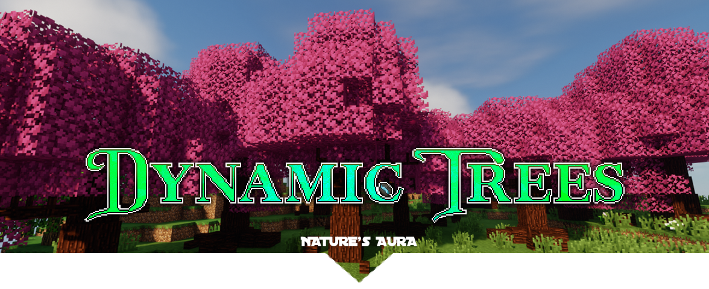

<h1 style="text-align: center">
Dynamic Trees for Nature's Aura
</h1>

    
    

Dynamic Trees compatibility add-on for Nature’s Aura.

## Download
Download at the [CurseForge page](https://www.curseforge.com/minecraft/mc-mods/dynamic-trees-natures-aura).

## Supported Trees
- Ancient Tree

## Translations
Thank you to the following people who spent their time making translations for the corresponding languages. 

If you speak another language and would like to help, please [join the Dynamic Trees Discord](https://discord.gg/bGby2qxvqu).

- 🇫🇷 19PixelsPlaced
- 🇪🇸 Jorgegiral
- 🇲🇽 EdicionGamerYT